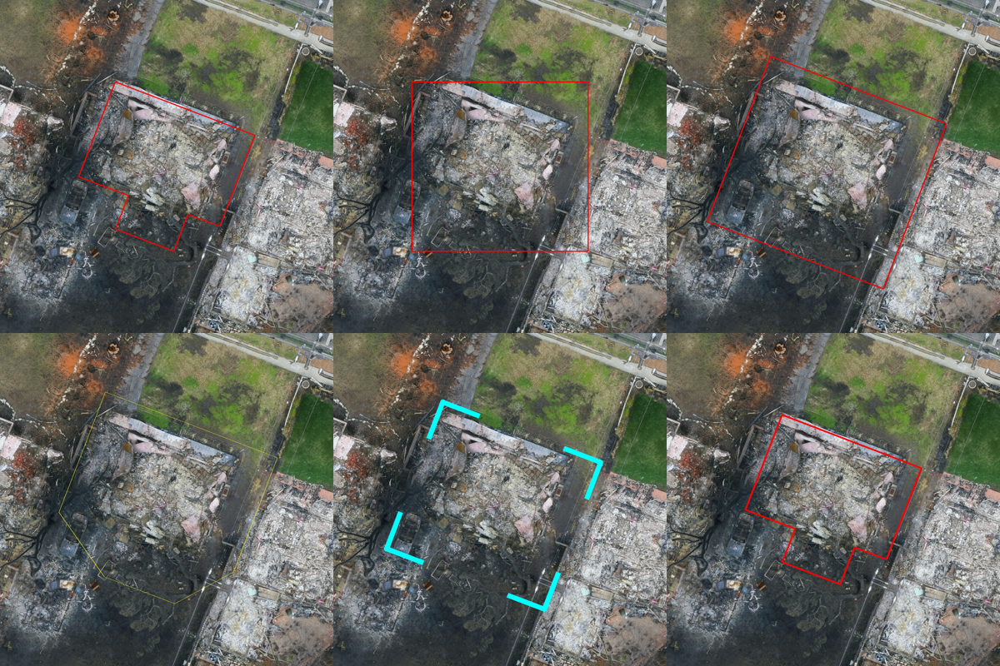

Aerial imagery
==============

Aerial workflows start from a georeferenced raster: a drone orthomosaic you
already have, or a basemap that rAPIdtools stitches for you from Bing or
Google tiles. :class:`~rapidtools.processing.AerialImageryExtractor` then
crops one patch per asset from that raster and attaches it to the asset.

Cropping an orthomosaic around each asset
-----------------------------------------

.. code-block:: python

   from rapidtools import AerialImageryExtractor, PhysicalAssetCollection

   buildings = PhysicalAssetCollection.from_geojson('buildings.geojson')
   extractor = AerialImageryExtractor(
       dataset='ortho.tif',                # a TIFF, a folder of TIFFs, or a list
       save_directory='output/crops',
       buffer_m=10,                        # margin around the footprint
       force_square_image=True,
       image_prefix='post_disaster',
   )
   buildings = extractor(buildings)
   buildings['bldg_01'].image_assets[0].properties['wgs84_bounds']

Each crop is saved as a JPEG named after the asset centroid and attached as
an :class:`~rapidtools.core.ImageAsset` whose properties record the crop's
WGS84 bounds and the source raster. When ``dataset`` is a folder, every
raster is opened once and only the assets inside its extent are processed,
so regional mosaics split across many files work without extra code.

Sizing the crop
~~~~~~~~~~~~~~~

``buffer_asset`` accepts a percentage of the asset's extent (``'20%'``, the
default), a real-world distance (``'10 m'``, ``'30 ft'``) or a bare number in
the raster's units; ``buffer_m`` is a shortcut for metres. With
``force_square_image=True`` every crop covers a square area on the ground,
which keeps aspect ratios consistent for the model.

Assets on the edge of the imagery
~~~~~~~~~~~~~~~~~~~~~~~~~~~~~~~~~

Coverage is judged from the raster's own mask, so nodata values, alpha bands
and internal masks all count. By default a crop is skipped when more than
``max_missing_data_ratio`` (20 %) of it is empty. For assets that straddle
the edge of a flight, switch to a footprint-based test instead:

.. code-block:: python

   AerialImageryExtractor(
       'ortho.tif', save_directory='crops',
       min_footprint_coverage=0.3,   # keep if 30 % of the footprint is imaged
       pad_edges=True,               # pad with nodata so crops keep their size
   )

Outlining the target asset
--------------------------

Dense neighbourhoods are where a model most often describes the wrong
building. ``overlay_asset_outline=True`` draws the asset onto the crop so the
prompt can refer to "the outlined building". The outline's shape, offset,
stroke and colour are configurable:

.. code-block:: python

   AerialImageryExtractor(
       'ortho.tif', save_directory='crops', buffer_m=8,
       overlay_asset_outline=True,
       outline_shape='corners',     # 'geometry' | 'bbox' | 'rotated_bbox' | 'convex_hull' | 'corners'
       outline_buffer='2 m',        # push the outline away from the asset
       outline_width='1%',          # of the shorter image side, or pixels
       outline_color='#00ffff',
   )

   One building from the Eaton Fire orthomosaic. Top row: the footprint
   itself, its bounding box, and a rotated bounding box pushed out by 2 m.
   Bottom row: a convex hull with a thin yellow stroke, cyan corner brackets,
   and the footprint with a stroke scaled to the image.

Corner brackets are worth trying for damage assessment: a closed line can
hide exactly the roof edge the model needs to see. Point assets are drawn as
a dot, or as a ring of radius ``outline_buffer`` when a buffer is set.

Basemaps without an API key
---------------------------

When you have footprints but no flight, stitch a basemap for the area.
:class:`~rapidtools.processing.BingOrthomosaicExtractor` and
:class:`~rapidtools.processing.GoogleOrthomosaicExtractor` download tiles in
parallel and write a georeferenced GeoTIFF that every other component reads
like a drone orthomosaic:

.. code-block:: python

   from rapidtools import BingOrthomosaicExtractor, BoundingBox

   region = BoundingBox.from_raster('eaton_patch_20250214.tiff')
   tiff = BingOrthomosaicExtractor(zoom_level=19, max_workers=10)(
       region, output_path='eaton_bing.tiff'
   )

Google's servers go up to about zoom 21 in urban areas and offer a hybrid
layer with labels (``layer='y'``). These endpoints are the ones used by the
Google Maps web app; they are unofficial and may change, and every request
fails soft with a logged error.

Per-polygon satellite crops
---------------------------

For a quick set of training images without a raster in between,
:class:`~rapidtools.data_sources.GoogleAerialImageExtractor` and
:class:`~rapidtools.data_sources.BingAerialImageExtractor` crop tiles
directly for every polygon in a GeoJSON file:

.. code-block:: python

   from rapidtools import GoogleAerialImageExtractor

   with GoogleAerialImageExtractor('output/aerial', zoom_level=20) as aerial:
       paths = aerial.process_geojson(
           'buildings.geojson', buffer_percent=0.1,
           pad_to_square=True, resize_to=(640, 640),
       )

Reading rasters directly
------------------------

:class:`~rapidtools.data_sources.OrthomosaicReader` is the low-level reader
behind the extractor. It opens a GeoTIFF once, reports its WGS84 extent,
crops a patch around any geometry with the same buffering rules, and slides a
window over the whole raster, skipping empty tiles:

.. code-block:: python

   from rapidtools import OrthomosaicReader

   with OrthomosaicReader('ortho.tif') as reader:
       bbox = reader.get_mosaic_bbox_wgs84()
       for image, bounds in reader.generate_tiles(patch_size=50, unit='meters'):
           ...   # a PIL image and its (min_lon, min_lat, max_lon, max_lat)
